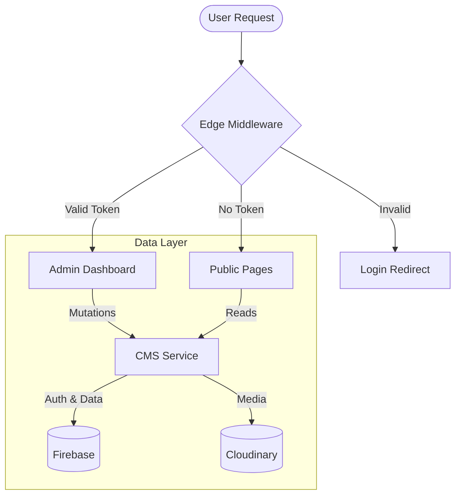

<div align="center">

# ⚡ Radiant Stellar

**The Next-Gen Personal Platform & Portfolio**

[](https://nextjs.org/)
[](https://react.dev/)
[](https://tailwindcss.com/)
[](https://firebase.google.com/)
[](https://www.typescriptlang.org/)

_Built with the bleeding edge of web technology. Fast, responsive, and beautifully animated._

[View Demo](https://zihadhasan.web.app) · [Report Bug](https://github.com/Z-root-X/zihadhasan/issues) · [Request Feature](https://github.com/Z-root-X/zihadhasan/issues)

</div>

<br />

## � Table of Contents

- [Overview](#-overview)
- [Key Features](#-key-features)
- [Architecture](#-architecture)
- [Tech Stack](#-tech-stack)
- [Project Structure](#-project-structure)
- [Getting Started](#-getting-started)
- [Deployment](#-deployment)
- [Contributing](#-contributing)
- [License](#-license)

---

## 🚀 Overview

**Radiant Stellar** is a comprehensive digital platform engineered for performance and scalability. Built on **Next.js 15** and **React 19**, it leverages the latest advancements in web development including **Tailwind CSS v4** for styling and **Firebase** for a serverless backend.

The architecture protects the admin dashboard with edge-based authentication while delivering public content via high-performance ISR (Incremental Static Regeneration).

## ✨ Key Features

| Feature | Description |
|---------|-------------|
| **🎨 Advanced UI/UX** | Immersive animations with **GSAP** and **Framer Motion**, plus smooth scrolling via `Lenis`. |
| **🔐 Secure Auth** | Edge-ready JWT verification using `jose` middleware protecting admin routes. |
| **🛍️ E-Commerce** | Complete shop functionality with cart management and checkout flows. |
| **📚 CMS & Blog** | Custom `cms-service` handling concurrency-safe Event & Course registrations. |
| **⚡ SEO Ready** | Built-in JSON-LD schema generation, `robots.ts`, and dynamic `sitemap.ts`. |
| **🛠️ Admin Panel** | Dedicated `(admin)` route group for content and data management. |

## 🏗️ Architecture

The app uses a **Edge-First** architecture. Public pages are statically generated or cached, while protected routes are verified at the Edge before hitting the main application logic.



### Core Systems

- **Smart CMS Service (`src/lib/cms-service.ts`)**: Acts as the Data Access Object (DAO). It handles complex logic like **transactional event registration** (preventing overbooking) and **soft deletes** (data safety).
- **Edge Middleware (`src/middleware.ts`)**: Uses standard Web APIs to verify JWTs rapidly without cold starts, ensuring high-performance security.

## 🛠️ Tech Stack

| Category | Technologies |
|----------|--------------|
| **Core** | Next.js 15 (App Router), React 19, TypeScript |
| **Styling** | Tailwind CSS v4, Radix UI, Lucide Icons |
| **Animation** | Framer Motion, GSAP, Lenis Scroll |
| **Backend** | Firebase (Firestore, Auth), Server Actions |
| **Services** | Cloudinary (Media), Resend (Email) |

## 📂 Project Structure

```bash
src/
├── actions/        # Server Actions (Mutations)
├── app/            # Next.js App Router (Routes)
│   ├── (admin)/    # Protected Admin Routes
│   └── (public)/   # Public Marketing/Blog Routes
├── components/     # React Components
│   ├── ui/         # Design System (Buttons, Cards)
│   ├── shared/     # Reusable Logic
│   └── ...features # Feature-specific components
├── lib/            # Utilities (Firebase, Helpers)
└── styles/         # Global CSS
```

## 🏎️ Getting Started

### Prerequisites
- Node.js 18+
- npm or pnpm

### Installation

1. **Clone the repository**
   ```bash
   git clone https://github.com/Z-root-X/zihadhasan.git
   cd zihadhasan
   ```

2. **Install dependencies**
   ```bash
   npm install
   ```

3. **Set up Environment Variables**
   Create a `.env.local` file:
   ```env
   NEXT_PUBLIC_FIREBASE_API_KEY=your_key
   NEXT_PUBLIC_CLOUDINARY_CLOUD_NAME=your_name
   ```

4. **Run Locally**
   ```bash
   npm run dev
   ```

## 🚀 Deployment

[](https://vercel.com/new/clone?repository-url=https%3A%2F%2Fgithub.com%2FZ-root-X%2Fzihadhasan)

## 🤝 Contributing

Contributions are welcome! Please fork the repository and submit a Pull Request.

## 📄 License

Distributed under the MIT License.
